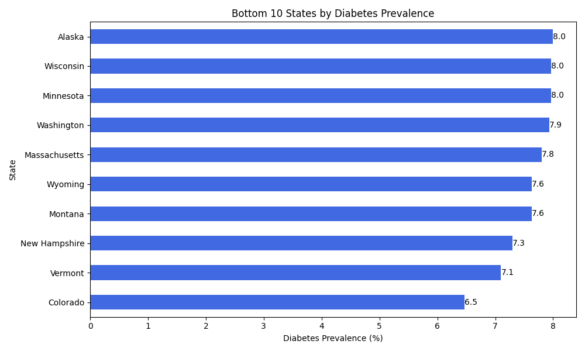
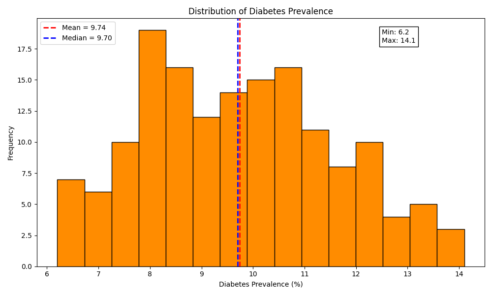
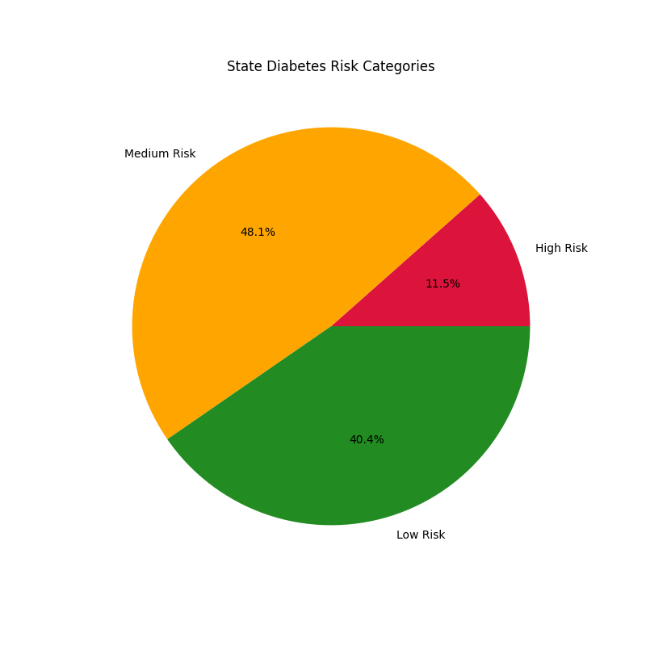
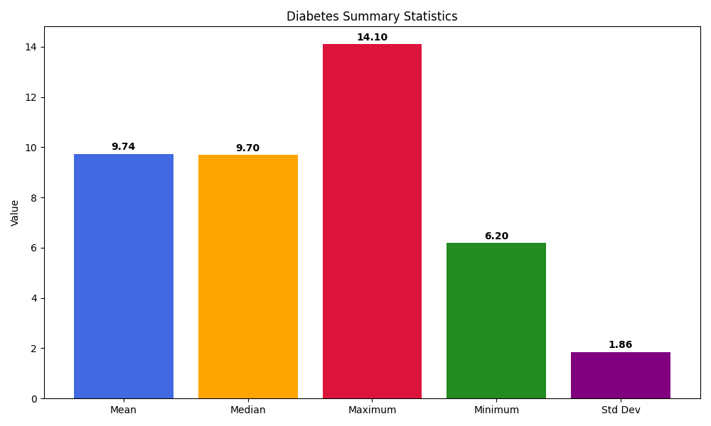

# Healthcare Population Health Analytics

## Project Overview

This project analyzes CDC Diabetes State Burden data to identify diabetes prevalence patterns across U.S. states.

Using Python, SQL, Pandas, Matplotlib, and SQLite, the project performs data cleaning, statistical analysis, visualization, and database querying to generate meaningful healthcare insights.

---

## Objectives

- Analyze diabetes prevalence across U.S. states
- Identify highest-risk and lowest-risk states
- Explore prevalence distribution patterns
- Generate healthcare insights using data analytics
- Perform SQL-based reporting and querying

---

## Dataset

Source: CDC Diabetes State Burden Toolkit

Dataset File:

```
diabetes_state_burden.csv
```

Dataset contains:

- State information
- Diabetes prevalence rates
- Demographic indicators
- Health statistics
- Geographic information

---

## Technologies Used

- Python
- Pandas
- Matplotlib
<<<<<<< HEAD
- Git
- GitHub

## Key Findings

- Mississippi has the highest diabetes prevalence.
- Southern states dominate the top 10 prevalence rankings.

## Visualization


## Author

Mounika Koppaka
LinkedIn: https://www.linkedin.com/in/mk2912
=======
- SQLite
- SQL
- Git
- GitHub

---

## Project Structure

```
healthcare-population-health-analytics/
│
├── analysis.py
├── analysis_v2.py
├── create_database.py
├── test_sql.py
│
├── diabetes_state_burden.csv
├── healthcare.db
├── state_diabetes_rankings.csv
│
├── sql_analysis.sql
├── advanced_sql_queries.sql
│
├── top10_diabetes_states.png
├── bottom10_diabetes_states.png
├── diabetes_distribution.png
├── risk_categories.png
├── summary_statistics.png
│
└── README.md
```

---

## Key Findings

### Highest Diabetes Prevalence States

| State | Average Prevalence (%) |
|---------|---------|
| Mississippi | 13.7 |
| Alabama | 13.3 |
| West Virginia | 13.1 |
| Louisiana | 12.4 |
| Kentucky | 12.3 |

### Lowest Diabetes Prevalence States

| State | Average Prevalence (%) |
|---------|---------|
| Colorado | 6.5 |
| Vermont | 7.1 |
| New Hampshire | 7.3 |
| Montana | 7.6 |
| Wyoming | 7.6 |

### National Statistics

- Mean Diabetes Prevalence: 9.74%
- Median Diabetes Prevalence: 9.70%
- Maximum Value: 14.10%
- Minimum Value: 6.20%
- Standard Deviation: 1.86%

---

## Visualizations

### Top 10 States by Diabetes Prevalence


---

### Bottom 10 States by Diabetes Prevalence



---

### Diabetes Distribution Analysis



---

### Diabetes Risk Categories



---

### Summary Statistics



---

## SQL Analysis

The project includes SQL queries for:

- Top 10 states by diabetes prevalence
- Bottom 10 states by diabetes prevalence
- National diabetes average
- High-risk state identification
- State-level aggregation analysis

Files:

- sql_analysis.sql
- advanced_sql_queries.sql

---

## Outputs Generated

### CSV Export

```
state_diabetes_rankings.csv
```

### SQLite Database

```
healthcare.db
```

### Visual Reports

- Top 10 States Chart
- Bottom 10 States Chart
- Distribution Analysis
- Risk Category Analysis
- Summary Statistics Dashboard

---

## Future Enhancements

- Power BI Dashboard
- Interactive Visualizations
- Healthcare Risk Prediction Models
- Machine Learning Integration
- Time-Series Trend Analysis

---

## Author

**Mounika Koppaka**

Healthcare Population Health Analytics Project
>>>>>>> 95b1636 (Complete healthcare population health analytics project)
