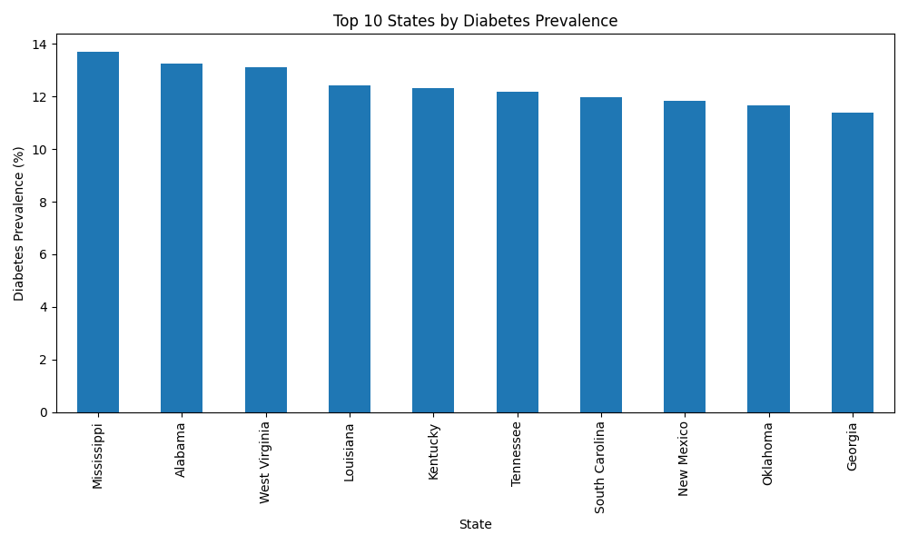

# Healthcare Population Health Analytics

## Project Overview

Analysis of CDC Diabetes State Burden data using Python and Pandas.

## Dataset

CDC Diabetes State Burden Toolkit

## Technologies

- Python
- Pandas
- Matplotlib
- Git
- GitHub

## Key Findings

- Mississippi has the highest diabetes prevalence.
- Southern states dominate the top 10 prevalence rankings.

## Visualization

## Author

Mounika Koppaka
LinkedIn: https://www.linkedin.com/in/mk2912
